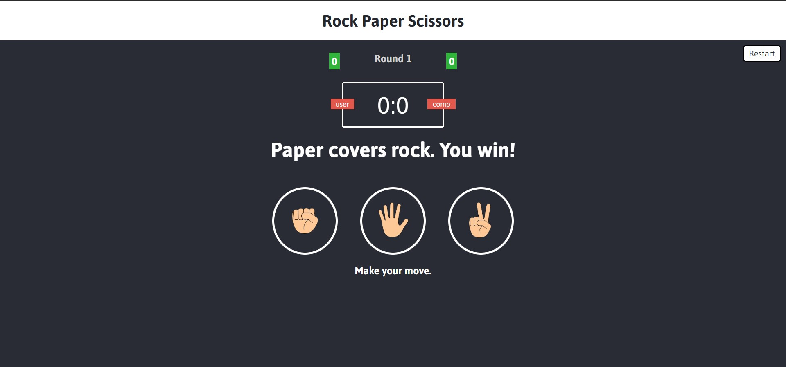
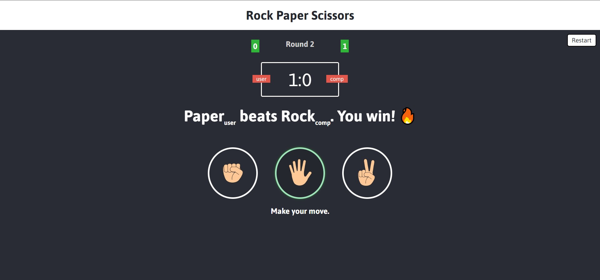
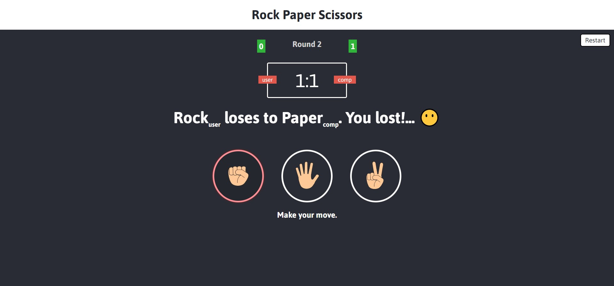
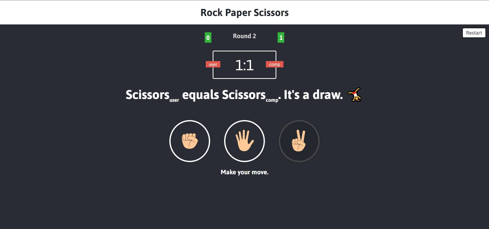

# Rock-paper-scissors
## :joystick: About the project
This is an old famous game rock-paper-scissors. The app is written on html-css-js. To start the project download the files and open the index.html file

## :computer: Functionality 

The main page after starting it. It has points counter, rounds counter and the restart option.

User should make a move then he will see the result. Win, lose or draw

  
